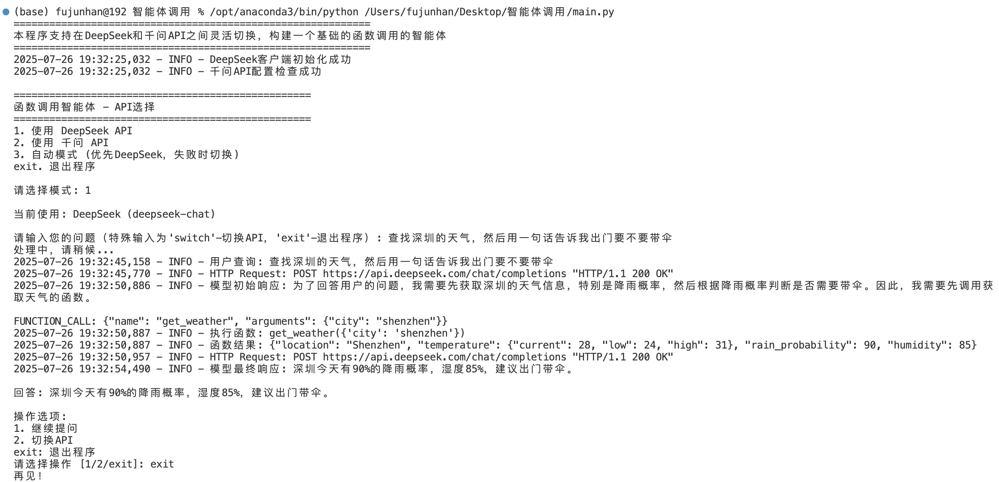
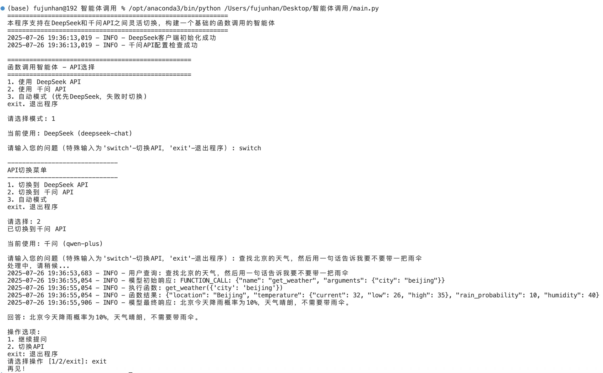

# 函数调用智能体思维链
## 1. 项目概述
本智能体模块支持在DeepSeek和千问API之间灵活切换的智能体系统，能够根据用户查询自动判断是否需要调用外部函数（天气查询系统），并整合结果给出最终回答（一句话）。
## 2. 模型/API使用
### 1）DeepSeek API
* 模型名称：deepseek-chat
* API连接方式：使用OpenAI兼容的API接口
### 2）Qwen API
* 模型名称：qwen-plus
* API连接方式：阿里云DashScope API
## 3. 模块运行
### 1）requirements
```bash
pip install -r requirements.txt
```
### 2）运行/测试
* config.py中 deepseek_api_key 和 qwen_api_key 需自行加入API KEY
* 运行main.py-本模块设置了较为完善的UI交互界面。启动后会显示主菜单，选择要使用的API模式:
  * 使用DeepSeek API
  * 使用千问API
  * 自动模式（优先DeepSeek API）
  * exit：随时退出程序
* 输入您的问题：
  * “查找深圳/北京的天气，然后用一句话告诉我出门要不要带伞。”
  * switch：切换API
  * exit：随时退出程序
* 测试案例（基础测试）：
* 测试案例（switch功能分析）：
### 3）AI借助部分
本模块开发90%为自主开发，AI仅帮助优化完善了 **class FunctionCallingAgent** 部分智能体核心类，使整体代码简洁化。